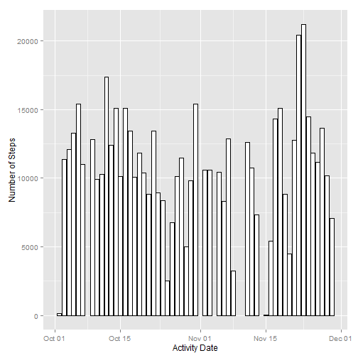
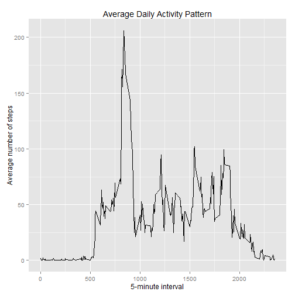
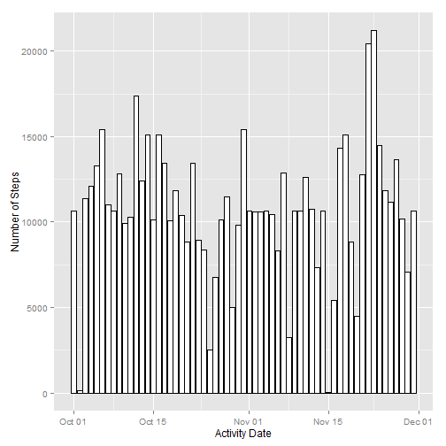
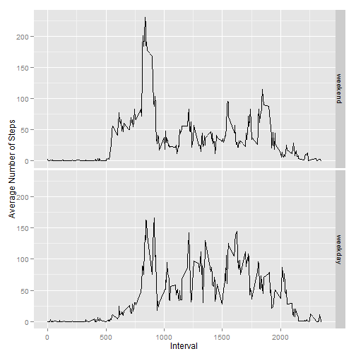

# Reproducible Research: Peer Assessment 1
<p>
The goal of this project is to analyze the activity data (in terms of steps) of an individual. The data contains
the steps that were taken during a 5 minute interval throughout the day.It was collected during the months of October and November of 2012.
</p>


## Loading and preprocessing the data
<p>
Before proceeding, please make sure that the path is set to the working directory where the file 'activity.csv' exist.
</p>

```r
# setwd('F:/My Development/My Testing Ground/Data Science/Data Science Cert
# - Code/Reproducible Research/Week 2/Peer Assessment
# 1/RepData_PeerAssessment1')

# Read the csv file contents
df = read.table("activity.csv", sep = ",", header = TRUE)

# Rename 'date' column to 'actDate'
names(df)[2] = "actDate"
```


### Data Summary

```r

# Column names
names(df)
```

```
## [1] "steps"    "actDate"  "interval"
```

```r

# Column content types
summary(df)
```

```
##      steps             actDate         interval   
##  Min.   :  0.0   2012-10-01:  288   Min.   :   0  
##  1st Qu.:  0.0   2012-10-02:  288   1st Qu.: 589  
##  Median :  0.0   2012-10-03:  288   Median :1178  
##  Mean   : 37.4   2012-10-04:  288   Mean   :1178  
##  3rd Qu.: 12.0   2012-10-05:  288   3rd Qu.:1766  
##  Max.   :806.0   2012-10-06:  288   Max.   :2355  
##  NA's   :2304    (Other)   :15840
```

```r

# Top 10 rows
head(df, nrow = 10)
```

```
##   steps    actDate interval
## 1    NA 2012-10-01        0
## 2    NA 2012-10-01        5
## 3    NA 2012-10-01       10
## 4    NA 2012-10-01       15
## 5    NA 2012-10-01       20
## 6    NA 2012-10-01       25
```


## What is mean total number of steps taken per day?
<b>1. Histogram</b>

```r

# Remove observations with missing steps (NA)
dfs = df[which(!is.na(df$steps)), c("steps", "actDate", "interval")]

# Group observations by steps taken each day
gdf = ddply(dfs, c("actDate"), function(x) c(total = sum(x$steps)))

# Convert the date to proper format
gdf$actDate = as.Date(gdf$actDate, "%Y-%m-%d")

# Create a histogram for the daily steps taken
ggplot(gdf, aes(x = actDate, y = total)) + geom_histogram(binwidth = 1, fill = "white", 
    color = "black", stat = "identity") + xlab("Activity Date") + ylab("Number of Steps")
```

 


<b>2. Mean and Median</b>

```r
# Finding the mean and median
dfMean = mean(gdf$total)
dfMedian = median(gdf$total)
```

The mean and median total number of steps taken per day are 10766 and 10765 respectively.


## What is the average daily activity pattern?
<b>1. Time Series Plot</b>

```r
# Remove observations with missing steps (NA)
dfs = df[which(!is.na(df$steps)), c("steps", "actDate", "interval")]


# Grouping the steps by every 5 minute interval (0, 5, 10...) and finding
# the mean of steps across all days
gdf = ddply(dfs, c("interval"), function(x) c(mean = mean(x$steps)))


# Create a time series plot showing the mean of steps taken across all days
# during every 5 minute interval
ggplot(gdf, aes(x = interval, y = mean)) + geom_line() + xlab("5-minute interval") + 
    ylab("Average number of steps") + ggtitle("Average Daily Activity Pattern")
```

 


<b>2. 5-minute Interval with The Maximum Number of Steps</b>

```r
# Which 5-minute interval, on average across all the days in the dataset,
# contains the maximum number of steps?
mxInterval = gdf[which(gdf$mean == max(gdf$mean)), c("interval")]
```

The 5-minute interval, on average across all the days in the dataset, that contains the maximum number of steps is 835.


## Imputing missing values
<b>1. Total Number of Missing Observations </b>

```r
# Total number of missing values
missNum = dim(df[which(is.na(df$steps) | is.na(df$actDate) | is.na(df$interval)), 
    c("steps", "actDate", "interval")])[1]

# The first 10 rows from the dataset that contains missing values
head(df[with(df, order(df$actDate, decreasing = TRUE)), ], 10)
```

```
##       steps    actDate interval
## 17281    NA 2012-11-30        0
## 17282    NA 2012-11-30        5
## 17283    NA 2012-11-30       10
## 17284    NA 2012-11-30       15
## 17285    NA 2012-11-30       20
## 17286    NA 2012-11-30       25
## 17287    NA 2012-11-30       30
## 17288    NA 2012-11-30       35
## 17289    NA 2012-11-30       40
## 17290    NA 2012-11-30       45
```

Total number of missing values in the dataset is 2304


<b>2. Devise Strategy for Imputing Missing Values</b>

```r
# Remove observations with missing steps (NA)
dfs = df[which(!is.na(df$steps)), c("steps", "actDate", "interval")]

# Grouping the steps by every 5 minute interval (0, 5, 10...) and finding
# the mean of steps across all days
gdfMean = ddply(dfs, c("interval"), function(x) c(mean = floor(mean(x$steps))))

# The imputeMean function will iterate through the data frame and impute
# missing step values with the mean value of steps taken during the
# corresponding 5 minute (0, 5, 10...) interval.
imputeMean = function(x) {
    if (is.na(x$steps)) {
        x$steps = gdfMean[which(gdfMean$interval == x$interval), c("mean")]
    }
    return(x)
}

imputeddf = ddply(df, c("steps", "actDate", "interval"), imputeMean)

# Total # of missing values in the imputed dataset
num = dim(imputeddf[which(is.na(imputeddf$steps) | is.na(imputeddf$actDate) | 
    is.na(imputeddf$interval)), c("steps", "actDate", "interval")])[1]
```

Total number of missing values in the imputed dataset is 0


<b>3. Dataset with Imputed Missing Step Values</b>

```r
# The first 10 rows from the new dataset with imputed missing values
head(imputeddf[with(imputeddf, order(imputeddf$actDate, decreasing = TRUE)), 
    ], 10)
```

```
##       steps    actDate interval
## 17281     1 2012-11-30        0
## 17282     0 2012-11-30        5
## 17283     0 2012-11-30       10
## 17284     0 2012-11-30       15
## 17285     0 2012-11-30       20
## 17286     2 2012-11-30       25
## 17287     0 2012-11-30       30
## 17288     0 2012-11-30       35
## 17289     0 2012-11-30       40
## 17290     1 2012-11-30       45
```


<b>4.a Histogram </b>

```r
# Group observations by steps taken each day
gdf = ddply(imputeddf, c("actDate"), function(x) c(total = sum(x$steps)))

# Convert the date to proper format
gdf$actDate = as.Date(gdf$actDate, "%Y-%m-%d")

# Create a histogram for the daily steps taken
ggplot(gdf, aes(x = actDate, y = total)) + geom_histogram(binwidth = 1, fill = "white", 
    color = "black", stat = "identity") + xlab("Activity Date") + ylab("Number of Steps")
```

 


<b>4.b Mean and Median</b>

```r
# Finding the mean and median
dfMean = mean(gdf$total)
dfMedian = median(gdf$total)
```

The mean and median total number of steps taken per day are 10750 and 10641 respectively.

<b>4.c Does the New Values Differ?</b><br/>
yes, the mean and median differ from those that were calculated during the first part of the assignment. Imputing changed the mean from 10766 to 10750 and the median from 10765 to 10641.


## Are there differences in activity patterns between weekdays and weekends?

```r
# For this section, we'll use the imputed dataset that was created above.
# The imputed dataset is ordered by actDate
gdf = imputeddf[with(imputeddf, order(imputeddf$actDate, decreasing = TRUE)), 
    ]
```


<b>1 Create New Factor Variable Column</b>

```r

# Create a factor variable (actDay) that contains two levels - weekday &
# weekend Add this new factor variable to the impute dataset that was
# created above
actDay = c("weekend", "weekday")
gdf$actDay = as.factor(actDay)
levels(gdf$actDay) = c("weekend", "weekday")

# Structure
str(gdf)
```

```
## 'data.frame':	17568 obs. of  4 variables:
##  $ steps   : num  1 0 0 0 0 2 0 0 0 1 ...
##  $ actDate : Factor w/ 61 levels "2012-10-01","2012-10-02",..: 61 61 61 61 61 61 61 61 61 61 ...
##  $ interval: int  0 5 10 15 20 25 30 35 40 45 ...
##  $ actDay  : Factor w/ 2 levels "weekend","weekday": 2 1 2 1 2 1 2 1 2 1 ...
```


<b>2. Create a Panel Plot Containing Time-Series Plot</b>

```r
# Iterate through each observation and add a new column value - actDay,
# which will be based on the value in actDate
addActDay = function(x) {
    if (isWeekend(as.Date(x$actDate, "%Y-%m-%d"))) {
        x$actDay = as.factor("weekend")
    } else {
        if (isWeekday(as.Date(x$actDate, "%Y-%m-%d"))) {
            x$actDay = as.factor("weekday")
        }
    }
    
    return(x)
}

wkData = ddply(gdf, c("steps", "actDate", "interval", "actDay"), addActDay)

# Top 10 rows of the modified dataset with the new column value - actDay
head(wkData, 10)
```

```
##    steps    actDate interval  actDay
## 1      0 2012-10-01        5 weekday
## 2      0 2012-10-01       10 weekday
## 3      0 2012-10-01       15 weekday
## 4      0 2012-10-01       20 weekday
## 5      0 2012-10-01       30 weekday
## 6      0 2012-10-01       35 weekday
## 7      0 2012-10-01       40 weekday
## 8      0 2012-10-01       50 weekday
## 9      0 2012-10-01       55 weekday
## 10     0 2012-10-01      100 weekday
```

```r

# Grouping the 'wkData' dataset by actDay values (weekday or weekend) and
# interval. Then take the mean of steps taken across all weekday or weekends
groupedWKData = ddply(wkData, c("actDay", "interval"), function(x) c(mean = mean(x$steps)))
levels(groupedWKData$actDay) = c("weekend", "weekday")

# Create a time series plot showing the mean of steps taken across all days
# during every 5 minute interval The base plot
p = ggplot(groupedWKData, aes(x = interval, y = mean)) + geom_line() + xlab("Activity Date") + 
    ylab("Average Number of Steps")

# Faceted by actDay in vertically arranged subpanels
p + facet_grid(actDay ~ .)
```

 


From the above two plots it is evident that the user was more active during the week than on weekends. That's is b/c the user had more average steps during week than on weekends. There is, however, an interesting characteristics to the Weekend plot and that is - during the 750 and 1000 interval, the user racked up more steps on the weekend than during the week. 
